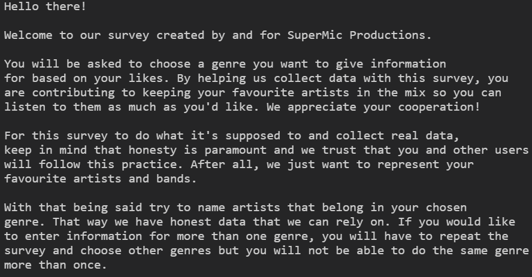
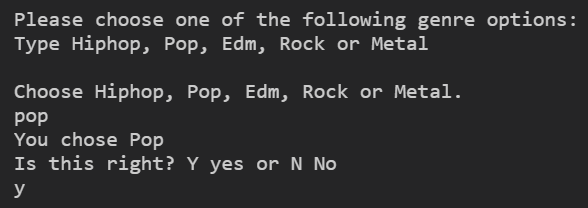
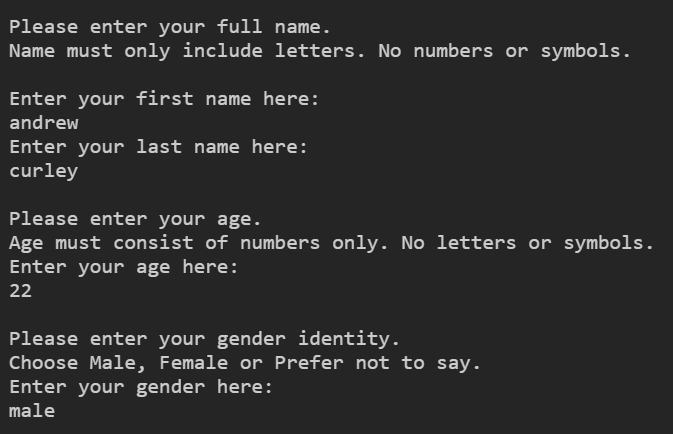
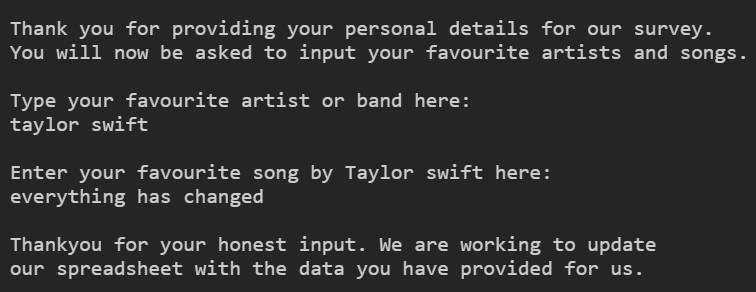
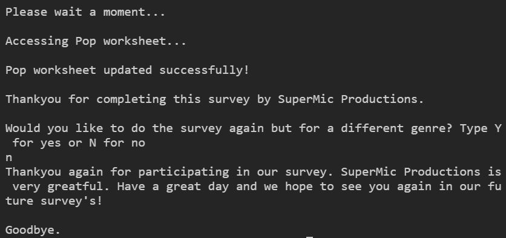
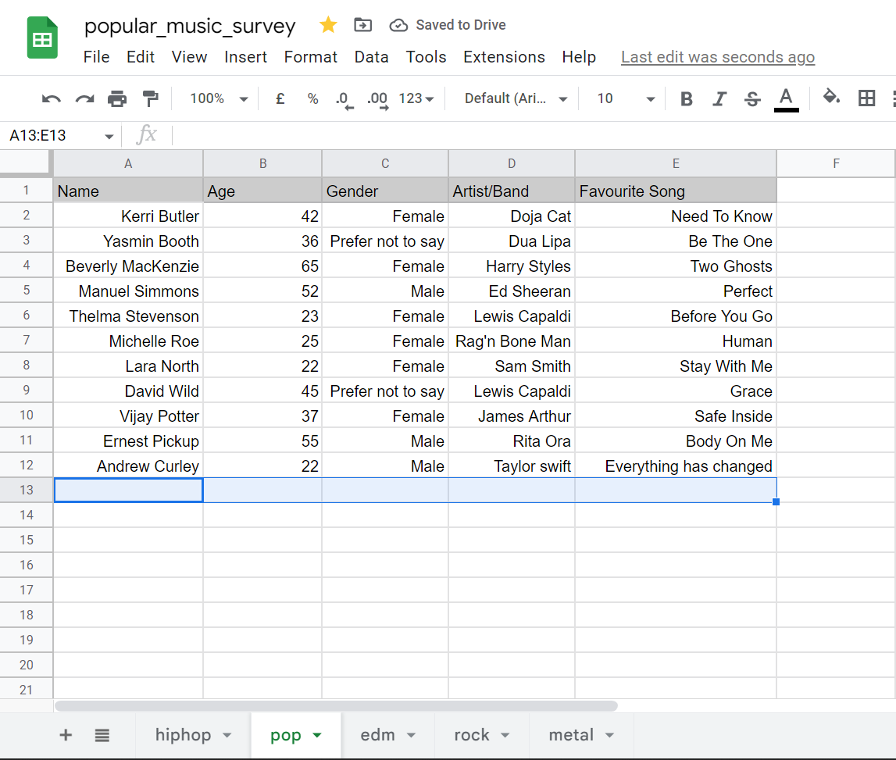
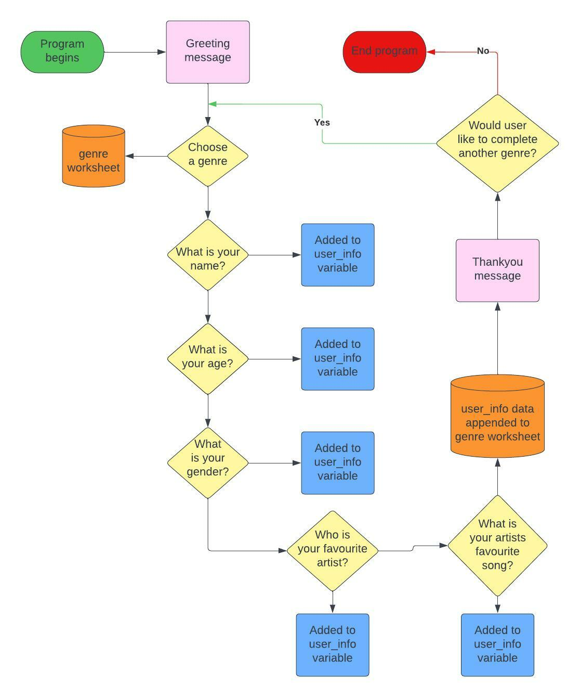
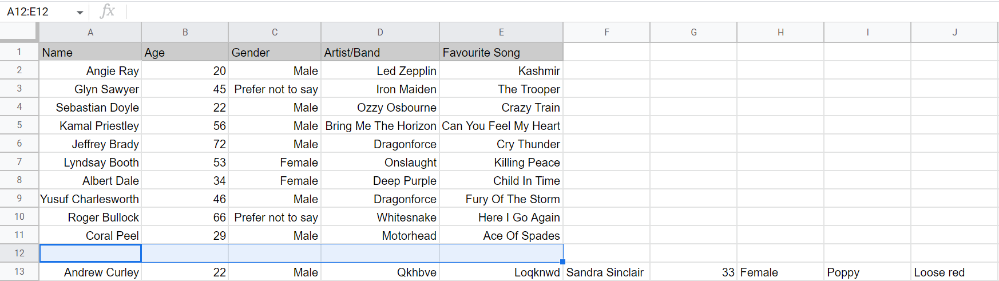
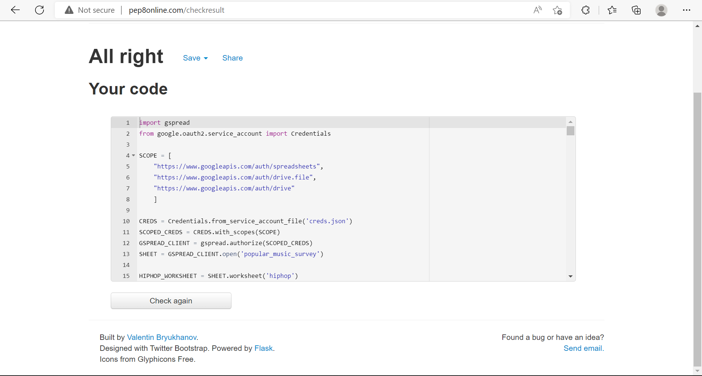
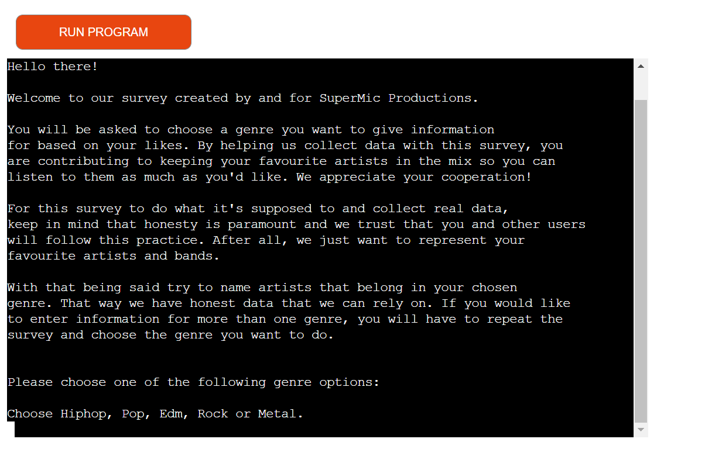

# SuperMic Productions Survey

## About

This a survey conducted by a made-up company called SuperMic Productions. Since there has been much growth over the past 10 years for number of artists, bands and musicians, the company cannot represent or publish everyones songs. Due to this increase in musical potential, the company needs a survey that will collect information from users. The survey will also allow users to request data from genre worksheets so they can see various information such as "Which genders prefer metal music" and so on.

## User experience reserch and design

### Strategy

SuperMic Productions is in need of a survey that will efficiently collect data from users to see which artist and bands are the most popular. This information will prove paramount when deciding which artists to represent.

The application should be able to successfully collect and process data into easily understandable and readable data. As to not have duplicate data, it will not allow a user to enter data for a genre if they have already done so. This is to keep results as true as possible otherwise, the company could make incorrect decisions based on false data. 

The benefits of creating a user friendly survey that is very accessable online are as follows:
- Program will not accept ridiculous answers sich as curse words or obviously wrong inputs like age as 1000 or 4
- It will allow users to add info for each genre if they wish because users can have favourites from different genres
- As it is an online survey, users need not worry about writing down their answers on paper and sending off the information
- users personal information is protected and will not be shared to third party companys

#### Leading User Stories

As a user:

- I want to be able to input my favourite artists and songs into the survey so I will be more likely to hear music from them in the future.
- I want to be able to choose whether I want to share my gender identity.
- I want to be able to share information for as many genres that are available.
- I want my personal information (Name, Age, Gender) to be protected amd not shared to third party companys for advertisement.
- I want to be able to request specific data from the survey so I can see what other people are listening to as to explore music further.

As the owner:

- I want to provide a survey that is quickly completed as to not take up lots of users time.
- I want to collect data from users so I can make better decisions for who I should represent proffesionally in the music industry.
- I want users to trust this survey will not share personal information with third party companys so they are more likely to participate in future surveys.
- I want to be able to allow users to glean over other users data as to find recommendations for themselves.

#### Strategy goals for the website

- The application will be provide an easily accessable survey to efficiently collect information from users.
- The questions in the survey will be easy to follow and only able to accept valid data
- Users who enjoyed this survey and found it wuick and easy to complete will participate in other future surveys or questionaires we create.

### Features

#### Features Currently Used

- A welcome message

- Double check correct genre choice as to prevent accidental input from user

- Collects name and age and gender identity

- Collects users artist and song choice

- Allows user to complete survey again for another genre

- Pass information to survey spreadsheet

#### Non-Existant Features (Future Surveys)

- Develop program to be phone and tablet friendly
- Request users email to be sent future surveys
- Allow users to create valid genres to add to spreadsheet
- Ask the user for the address which would not be shared with anyone
- Allow users to choose from "A, B, C, D or E" instead of typing the whole genre option

### Structure

The site will follow these strcutural guidelines:

1. The user will be greeted and guided to how to answer the survey's questions
2. They will then be asked to choose a genre they would like to provide information for
3. If they have already used a genre, they will be told they cannot use a genre more than once
4. Then will be asked to provide there first and last name, age and gender identity(an option is available to prefer not to say)
5. Then be thanked for their personal info and assure the user it will remain protected from third party companys
6. Asked to give their favorite artist and the artists song in their specified genre
7. Notify the user that the worksheet of data is being updated and has done successfully
8. User is finally asked if they want to provide information for another genre. If yes the program runs again, if no, The user is thanked again and the program bids goodbye

### Flowchart

A flowchart providing an easy step by step view of how the program will primarily run:

### Bugs and Issues Encountered (Fixed)

1. Whilst trying to validate the name variable inside of the get_info method, I kept getting an error message "name is not defined". 
- I reserched for a solution and came across the global attribute. I added it in front of name and then defined name below which worked great

2. I was attempting to check that the value of name, only included alphabetical letters by using the following code (if name != str():). 
- This did not work so I added a while true statement to check the whole value at once, then used the .isalpha() method at the end of fname and lname variables in the if statement.

3. While trying to implement a try statement to print a ValueError message to the user, Typing an incorrect value would not cause an error message to pop up.
- Chose to just print an error message to the user using an if: elif: else: statement.

4. I created a method that would check the genre the user chose and pass all of their information into the corresponding worksheet. But during testing, I was met with a massive incomprehensable error. I logged a tutor session with code institute and whilst typing the issue I was having I realized where I went wrong before the tutor could offer assistance.
- I saw that inside the if statement of the update_genre_worksheet() method, I placed the genre variable inside of the append_row() method when I actually needed to place it in the user_info variable because that is where the users inputs are stored.

5. My validate_name() method would only accept a firstname as the isalpha() method would throw an error if the user used a space to seperate first and last names. 
- I created three variables. 'fname' to hold the users first name, 'space' to literally have a single space in it and 'lname' to contain a users last name. I then wrote   name = fname + space + lname. This solved my problem.

6. When testing the validate_age() method, I realized that a user could input a ridiculous number as an age. I tried using:  if age > 80 or age < 16: but that produced an error stating "not supported between instances of str and int". This was because the value of age was a string.
- Inside the if statement, I used int(age) to convert the value to an integer so the condition would work, which it did.

7. During another test, the program would print an error and edn the program if a deciaml (float) number was entered for the age variable. I tried adding  and age.float() to the if statement where the age cannot exceed 80 or be below 16.
- I solved the problem by adding  elif float(age). So the program will print an error message to the user and they will be forced to try again.

8. This bug occured immediatelt after solving issue no. 7. I would be given an error message during testing stating "Must be a whole number" which was because I converted age into a float. 
- The solution was simple. I changed it to  elif age == float(age). Solved without any other issues.

9. Towards the end of the development, I changed some of my code so that name, age and gender did not need to have global attributes but instead have the methods return the value of the variables. Whilst trying to do this with genre, multiple lines of code displayed the error message "genre not defined".
- As I was running low on time to figure out the solution to this, I reverted to my original code only for the get_genre method.

### Unsolved Issues And Bugs

This is a short list of issues I encountered that I couldn't solve either while testing code or changing for new code to improve the program. 

- For the get_age() method, I tested it by typing 2.d2, which caused the program to show an error because it cant be converted to a float and so the if statement cannot be run. This causes the program to end.
- I attempted to replace the list of VALID_GENRES with a dictionary so the user could type 1, 2, 3, 4 or 5 instead of the individual genres but I couldn't figure out how to implement in properly so left it out.
- Whilst testing the option of doing the survey and providing information for the same genre, the information does not append to a new row but is instead appended to the end of the row first used. 

## Testing

I used the appropriate validation service pep8 to check my code has no/least amount of issues as possible.

### Deployment

Below is a step by step guide of how I deployed my application using heroku:

1. From the Heroku dashboard, click "create new app".
2. Give app a name and select region and click "create app".
3. Go to the settings tab first.
4. add convig var named CREDS using the value of the creds.json file as the value next to the key name.
5. Add 2 buildpacks called python, and then nodejs. These buildpacks need to have python at the top. Click and drag if necessary.
6. Head over to the deployment tab.
7. In the deployment method section, choose github from the options provided.
8. In the next section, type the name of your API file to link with your application "popular_music_survey" for this specific deployment.
9. Finally, choose automatic deployment as to update the application with any necessary changes made in gitpod and click the view button beneath the complettion message to test or use the program.

Should look like this:

### Credits
- Sean at code institute for a mentoring session to solve an issue
- My mentor Brian Macharia for continuous support and guidance
- W3Schools.com for providing helpful code snippets to help with my issues and bugs
- [Rickofmanc](https://github.com/RickofManc/vv-pizzas) RickofManc as I took inspiration from their readme presentation and layout.